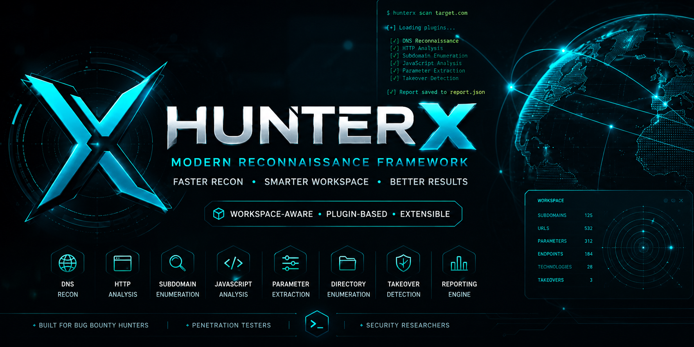

<!-- ========================================================= -->

<!-- Banner -->

<!-- ========================================================= -->

<p align="center">
  
</p>

<h1 align="center">HunterX</h1>

<p align="center">
  <strong>Modern Workspace-Aware Reconnaissance Framework</strong>
</p>

<p align="center">
  Built for Bug Bounty Hunters • Penetration Testers • Security Researchers
</p>

<p align="center">
  Fast • Modular • Intelligent • Extensible
</p>

---

<p align="center">

<a href="https://pypi.org/project/hunterx-reconhive/">

</a>

<a href="LICENSE">

</a>

<a href="https://www.python.org/">

</a>

<a href="https://github.com/ReconHive/HunterX/stargazers">

</a>

<a href="https://github.com/ReconHive/HunterX/issues">

</a>

</p>

<p align="center">

🇺🇸 English • 🇮🇷 <a href="README_FA.md">فارسی</a>

</p>

---

<p align="center">

</p>

---

# HunterX

HunterX is a modern reconnaissance framework written entirely in Python.

Unlike traditional reconnaissance tools, HunterX executes plugins through a shared workspace, allowing collected artifacts to be reused across scans instead of repeating the same network operations.

Its modular architecture, automatic dependency resolution, and workspace-aware execution make reconnaissance faster, cleaner, and more efficient.

---

# 🚀 Quick Install

Using pip

```bash
pip install hunterx-reconhive
```

Using uv

```bash
uv tool install hunterx-reconhive
```

---

# ⚡ Quick Start

Run a complete reconnaissance scan.

```bash
hunterx scan example.com
```

Run only selected plugins.

```bash
hunterx scan example.com -p dns,http,crawler
```

Generate a report.

```bash
hunterx scan example.com -o report.json
```

More examples are available in the Wiki.

---

# Why HunterX?

HunterX is designed around a simple philosophy:

**Discover once. Store everything. Reuse everywhere.**

Instead of repeating reconnaissance tasks, plugins share artifacts through a common workspace. This minimizes redundant requests, speeds up scans, and enables intelligent plugin orchestration.

---

# Features

* Modular plugin architecture
* Workspace-aware execution
* Automatic dependency resolution
* DNS reconnaissance
* HTTP fingerprinting
* Subdomain enumeration
* Website crawling
* JavaScript analysis
* Parameter extraction
* Directory enumeration
* Port scanning
* TLS inspection
* Takeover detection
* JSON & Markdown reports
* Rich terminal interface
* Extensible plugin system

---

# 📚 Documentation

Complete documentation is available in the GitHub Wiki.

| Guide                 | Description                    |
| --------------------- | ------------------------------ |
| Installation          | Install HunterX                |
| Quick Start           | Run your first scan            |
| CLI Reference         | Command-line options           |
| Plugins               | Available plugins              |
| Workspace             | Shared artifact storage        |
| Dependency Resolution | Automatic plugin orchestration |
| Architecture          | Framework design               |
| Examples              | Practical workflows            |
| FAQ                   | Frequently asked questions     |

---

# 🏗 Architecture

```text
             CLI
              │
              ▼
      HunterX Core Engine
              │
              ▼
   Dependency Resolution
              │
              ▼
      Workspace Engine
              │
      ┌───────┼────────┐
      ▼       ▼        ▼
     DNS     HTTP   Crawler
                      │
             ┌────────┴────────┐
             ▼                 ▼
      JavaScript         Parameters
             │
             ▼
      Report Generator
```

See the Wiki for a detailed explanation of the architecture.

---

# 🤝 Community

Contributions are always welcome.

* Report bugs
* Suggest new features
* Submit pull requests
* Improve documentation

If HunterX helps your security research, consider giving the project a ⭐ on GitHub.

---

# 📄 License

MIT License.

---

# ⚠ Disclaimer

HunterX is intended for authorized security assessments and educational purposes only.

The author assumes no responsibility for misuse or damage caused by this software.
